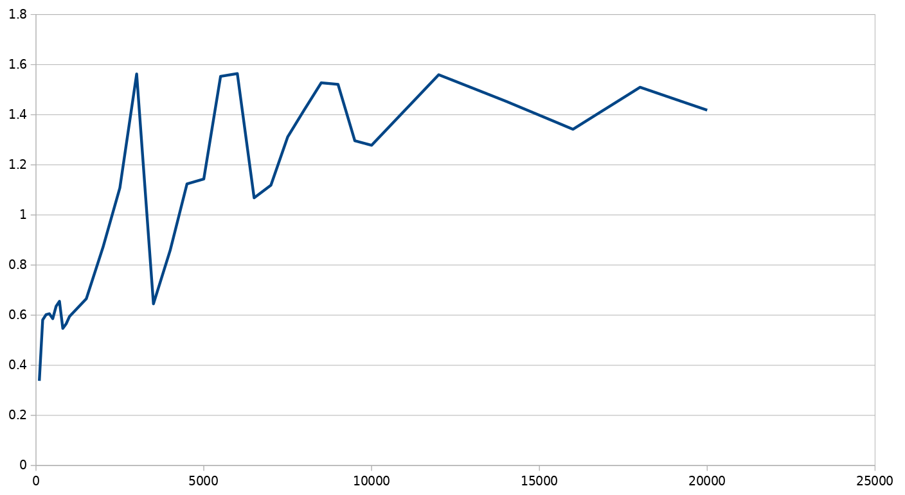

# Matrix-Multiplier

This library implement some basic matrix operations, with an emphasis on fast matrix multiplications. To achieve fast performance, we use 1) AVX2 SIMD instructions for better single core utilization, 2) a threaded work distribution algorithm for multi-core utilization and 3) hierarchical workload ordering within a single core for caching.

### Single core utilization through SIMD instructions

A large matrix multiplication can be decomposed into smaller matrix multiplications, whose results we either concatenate along an axis or add. To make the problem tractable for SIMD, we have optimized implementations for 8x8 and 16x16 square matrices. This is a convenient allocation, as 8 fp32 floats fit exactly into 256-bit AVX registers, which can be efficiently multiply-added with each other, shuffled or loaded/stored. The full matrix is padded if it's dimensions don't divide evenly into 8. As writing these kernels by hand is repetitive and error prone, [code generation is used](local_gen.py).

### Multithreaded work distribution algorithm

The multiplication work is partitioned in a way that every thread writes to a disjoint portion of the output matrix. As no worker thread ever reads the output of another thread, output locking is not needed.

### Hierarchical workload ordering within cores

The work each core receives is ordered in a way to minimize cache misses. We use 3D [z-ordering](https://en.wikipedia.org/wiki/Z-order_curve) for scheduling the 8x8 and 16x16 matrix multiplications. (Matrix multiplication is a `O(N^3)` algorithm, thus the three dimension.)

## Performance

Combining these optimizations results in execution speed that in some cases exceeds what OpenBLAS has to offer. Here's a comparison with x-axis being the matrix dimension (only square matrices were compared), and y-axis the measured speedup. For an i5-5200U CPU, my library's performance is approximately 3x worse for small matrices (~100x100), but is consistently ~1.4x better for huge matrices (~10000x10000).

